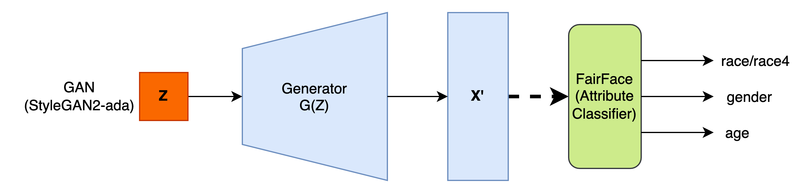
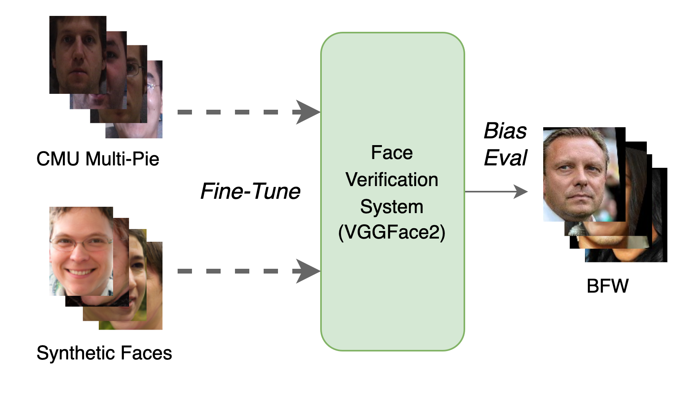
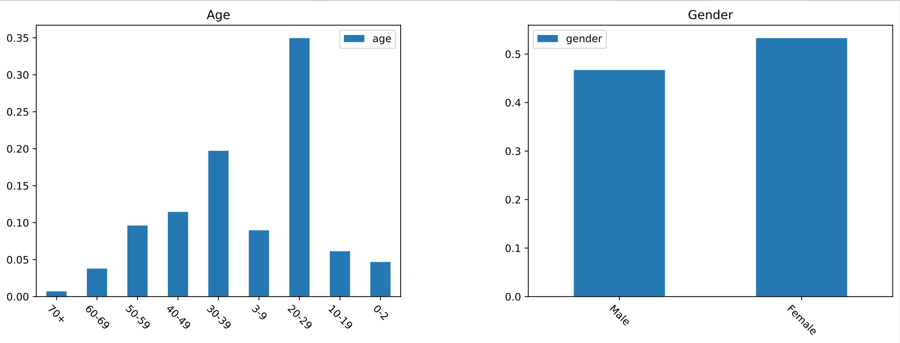
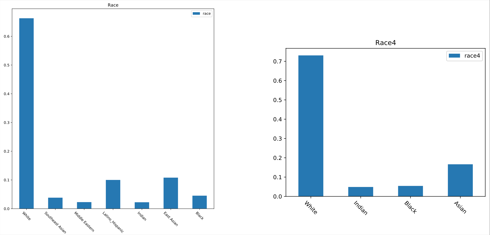
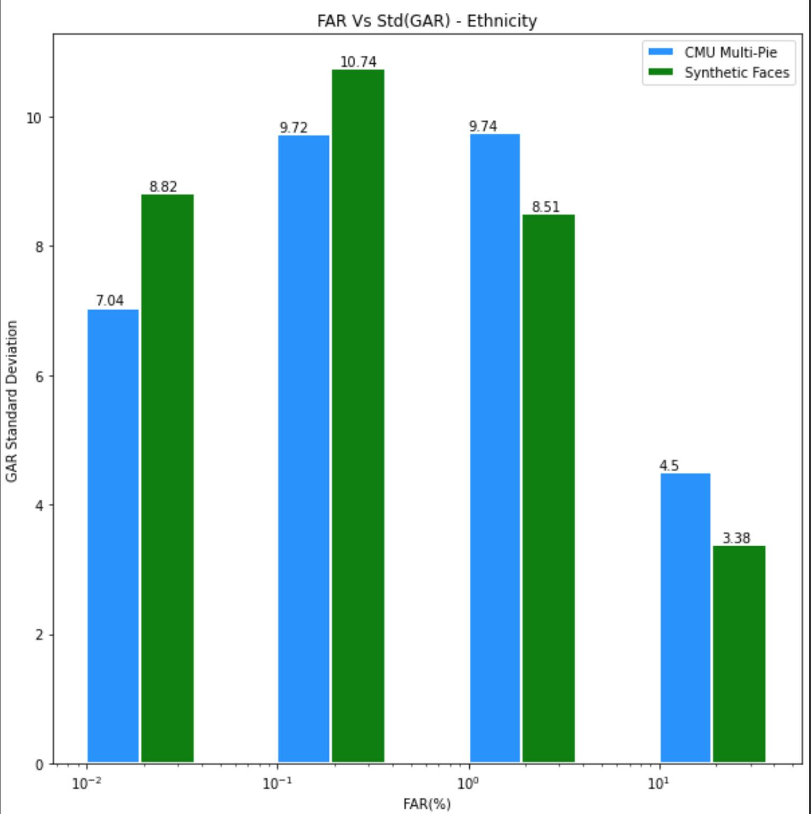
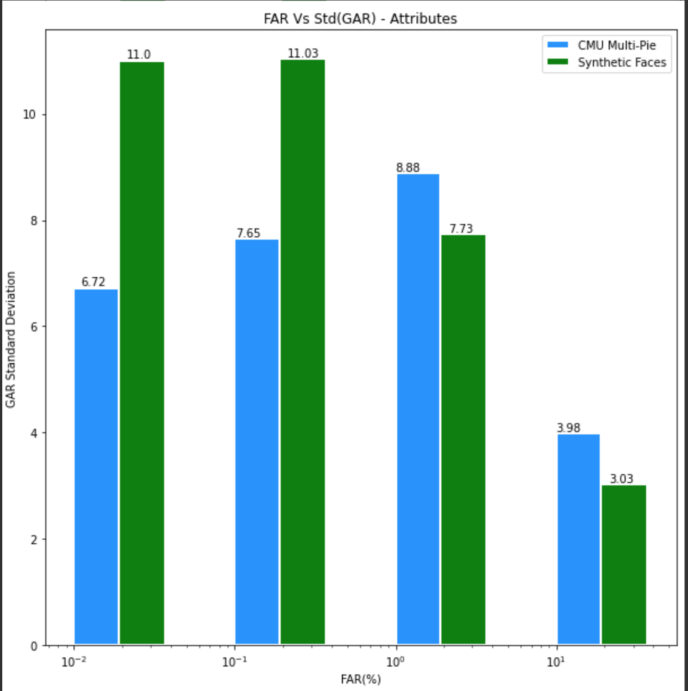
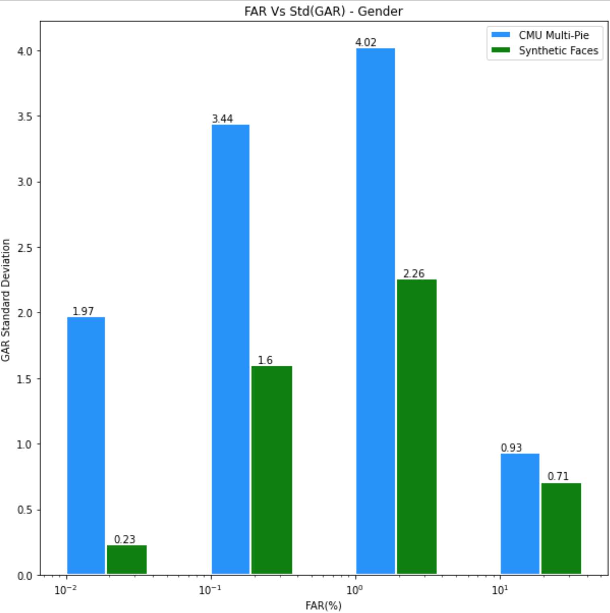

# On Biased Behavior of GANs for Face Verification (Responsible Computer Vision Workshop, ECCV 2022)

This work is carried out as part of my Masters Thesis - ***"Bias and Fairness in Low Resolution Image Recognition"*** under the guidance of [Dr. Mayank Vatsa](http://home.iitj.ac.in/~mvatsa/) and [Dr. Richa Singh](http://home.iitj.ac.in/~richa/)

[](https://opensource.org/licenses/Apache-2.0)
[](https://www.python.org/downloads/release/python-382/)
[](https://pytorch.org/)

## Requirements:


## Datasets:

| Dataset | Description                       
| :-------- |:-------------------------------- |
| [FFHQ](https://github.com/NVlabs/ffhq-dataset)|This stands for Flickr-Faces-HQ is a dataset of 70,000 human faces of high resolution 1024x1024 and covers considerable diversity and variation.|
| [CMU Multi-PIE](https://www.cs.cmu.edu/afs/cs/project/PIE/MultiPie/Multi-Pie/Home.html)| is a constrained dataset consisting of face images of 337 subjects with variation in pose, illumination and expressions. Of these over 44K images of 336 subjects images are selected corresponding to frontal face images having illumination and expression variations.|
| [BFW](https://github.com/visionjo/facerec-bias-bfw)|This is balanced across eight subgroups. This consists of 800 face images of 100 subjects, each with 25 face samples.The BFW dataset is grouped into ethnicities (i.e., Asian (A), Black (B), Indian (I), and White (W)) and genders (i.e., Females (F) and Males (M)) shown in (b) figure 2.2.1. The metadata for this dataset consists of list of pairs for face verification. Hence, this dataset can be used to investigate bias in automatic facial recognition (FR) system for verification protocol.|


## Architectures:

### Experiment-1:

||
|:--:| 
| *GAN Bias Estimator*|

| Model | Description                       
| :-------- |:-------------------------------- |
| [StyleGAN2-ADA](https://github.com/NVlabs/stylegan2-ada-pytorch)| The generator of StyleGAN2 with adaptive discriminator augmentation (ADA) trained on FFHQ dataset is used to generate synthetic face images.|
| [Fairface](https://github.com/dchen236/FairFace)|This is a pretrained Fairface attribute classifier trained on **FairFace: Face Attribute Dataset for Balanced Race, Gender, and Age.**|


### Experiment-2:

||
|:--:| 
| *Bias Estimation in Face Verification System*|


| Model | Description                       
| :-------- |:-------------------------------- |
| [VGGFace2](https://github.com/ox-vgg/vgg_face2)|This is a resnet50 backbone trained with MS-Celeb-1M and the fine-tuned with VG- GFace2 dataset.|
| [DiscoFaceGAN](https://github.com/microsoft/DiscoFaceGAN)|This  is a pretrained model where faces of non-existent people with variations of pose, expression and illumination can be generated. The model is trained using imitative-contrastive learning to learn dientangled representations. This model trained with FFHQ data set is considered for analysis.|


## Experimental Setup:
### Experiment-1:

Clone the repository

> git clone https://github.com/ksasi/fairDL.git

Clone StyleGAN2-ADA repository

> git clone https://github.com/NVlabs/stylegan2-ada-pytorch.git

Clone FairFace repository

> git clone https://github.com/dchen236/FairFace.git 

Install using pip

> pip install -r requirements.txt

### Experiment-2:

Clone the repository

> git clone https://github.com/ksasi/fairDL.git


Install using pip

> pip install -r requirements.txt


#### *MultiPie51 Dataset :*

Obtain 336 subjects of [CMU Multi-PIE](https://www.cs.cmu.edu/afs/cs/project/PIE/MultiPie/Multi-Pie/Home.html) dataset and split into 70-30 ratio for training and testing.

Place the training split in **MultiPie51train** folder
> Ex:- \<root\_folder\>/fairDL/data/MultiPie51train/id_34

Place the testing split in **MultiPie51test** folder
> Ex:- \<root\_folder\>/fairDL/data/MultiPie51test/id_299

#### *Synthetic Dataset :*

Clone DiscoFaceGAN repository

> git clone https://github.com/microsoft/DiscoFaceGAN.git

Execute the following to generate synthetic faces

> python generate_images.py --subject=2500 --variation=4
> 

Execute the following to move 2000 subjects to synthface folder and 500 subjects to synthfacetest
 
> cd \<root\>/fairDL
> 
> python process\_data.py --indir \“\<root\>/DiscoFaceGAN/generate_images\” --traindir \“\<root\>/fairDL/data/synthface\” --testdir \“\<root\>/fairDL/data/synthfacetest\”

Preprocess the synthetic dataset to extract faces and resize

> python preprocess.py  --source\_path \<root\>/fairDL/data/synthface --target\_path \<root\>/fairDL/data/synthface\_processed
> 
> python preprocess.py  --source\_path \<root\>/fairDL/data/synthfacetest --target\_path \<root\>/fairDL/data/synthfacetest\_processed


#### *BFW Dataset :*

Obtain and setup bfw dataset under data directory

Ex:- \<root\>/fairDL/data/bfw

## Fine-tuning and Bias Evaluation Scripts:

### Experiment-1:

Generate synthetic faces from StyleGAN by executing stylegan2_generator.py in src folder  under fairDL as below :

> python stylegan2\_generator.py --num=2000 --outdir=../data/stylegan2
> 
> python generate\_csv.py --imgdir=../data/stylegan2 --outdir=../results


Navigate to FairFace folder and execute scripts as below :

> rm -rf detected\_faces
> 
> python predict.py --csv ../fairDL/results test\_imgs.csv
> 
> cp test\_outputs.csv ../fairDL/results/test_outputs\_1.csv
> 
> rm -rf test\_outputs.csv

Navigate to src folder  under fairDL and execute the below to generate plots :

> python generate\_plots\_attrib.py --src=../results/test\_outputs\_1.csv --outdir=../results

Plots namely **plot\_race.pdf, plot\_race4.pdf, plot\_gender.pdf** and **plot\_age.pdf** are generated in results folder.


### Experiment-2:

##### Fine-tune with _CMU-MultiPie dataset_ and Evaluate with BFW dataset :

* Finetune

> python -u \<root\>/fairDL/src/fine\_tune.py --save\_path=\<root\>/fairDL/checkpoints/VGGFace2\_CMU\_ --model="VGGFace2" --dataset="CMU" --num\_classes=1180 --arch="VGGFace2" --epochs=10 --batch\_size=128 --learning\_rate=1e-4 --weight\_decay=1e-4 --momentum=0.9 >> \<root\>/fairDL/results/VGGFace2\_MultiPie51\_out.log

* Predict

> python \<root\>/fairDL/src/predict.py --model="VGGFace2"  --state="finetuned" --file="\<root\>/fairDL/data/bfw/bfw-v0.1.5-datatable.csv" --root\_path="\<root\>/fairDL/data/bfw/Users/jrobby/bfw/bfw-cropped-aligned/" --output\_file="\<root\>/fairDL/results/fine\_tuned\_cmu_pred.csv" --model\_checkpoint="\<root\>/fairDL/checkpoints/VGGFace2\_CMU\_model\_10\_checkpoint.pth.tar"

* Evaluate

> python -u \<root\>/fairDL/src/evaluate.py --state="cmu\_finetuned" --predfile="\<root\>/fairDL/results/fine\_tuned\_cmu\_pred.csv" --outdir="\<root\>/fairDL/results" >> \<root\>/fairDL/results/out\_eval\_finetuned\_cmu.log


##### Fine-tune with _Synthetic dataset_ and Evaluate with BFW dataset :

* Finetune

> python -u \<root\>/fairDL/src/fine\_tune.py --save\_path=\<root\>/fairDL/checkpoints/VGGFace2\_Synth_ --model="VGGFace2" --dataset="Synth" --num\_classes=1180 --arch="VGGFace2" --epochs=10 --batch\_size=128 --learning\_rate=1e-4 --weight\_decay=1e-4 --momentum=0.9 >> \<root\>/fairDL/results/VGGFace2\_Synth\_out.log

* Predict

> python \<root\>/fairDL/src/predict.py --model="VGGFace2"  --state="finetuned" --file="\<root\>/fairDL/data/bfw/bfw-v0.1.5-datatable.csv" --root\_path="\<root\>/fairDL/data/bfw/Users/jrobby/bfw/bfw-cropped-aligned/" --output\_file="\<root\>/fairDL/results/fine\_tuned\_synth\_pred.csv" --model\_checkpoint="\<root\>/fairDL/checkpoints/VGGFace2\_Synth\_model\_10\_checkpoint.pth.tar"

* Evaluate

> python -u \<root\>/fairDL/src/evaluate.py --state=“synth\_finetuned" --predfile="\<root\>/fairDL/results/fine\_tuned\_synth\_pred.csv" --outdir="\<root\>/fairDL/results" >> \<root\>/fairDL/results/out\_eval\_finetuned\_synth.log

##### DoB<sub>fv</sub> i.e Std(GAR @ FAR) Plots :

> DoB<sub>fv</sub> i.e Std(GAR @ FAR) for Ethnicity, Gender and Attributes with CMU Multi-Pie
and Synthetic faces (smaller is better for bias) can be obtained from "Plots\_DoB\_fv.ipynb" notebook


## Results:

### Experiment-1:

||
|:--:|
| *GANs Biased towards age group “20-29”*|

||
|:--:|
| *GANs are biased towards “white” faces*|

### Experiment-2:

||
|:--:|
||
||
|*Face Verification models trained or fine-tuned with Synthetic faces exhibit bias for ”race” attribute*|

## Contact:

For questions and clarifications, please contact [@ksasi](https://github.com/ksasi) or raise an issue on GitHub.


## References:

The code is adapted from the following repositories:

1. [VGGFace2 Dataset for Face Recognition](https://github.com/ox-vgg/vgg_face2)
2. [PyTorch Metric Learning](https://kevinmusgrave.github.io/pytorch-metric-learning/losses/)
3. [stylegan2-ada-pytorch](https://github.com/NVlabs/stylegan2-ada-pytorch)
4. [DiscoFaceGAN](https://github.com/microsoft/DiscoFaceGAN)
5. [FairFace](https://github.com/dchen236/FairFace)


## Paper :

[https://arxiv.org/abs/2208.13061](https://arxiv.org/abs/2208.13061)

## How to cite this repository

If you used this repository in your work, please cite the paper as below:

```
@article{kotti2022biased,
  title={On Biased Behavior of GANs for Face Verification},
  author={Kotti, Sasikanth and Vatsa, Mayank and Singh, Richa},
  journal={arXiv preprint arXiv:2208.13061},
  year={2022}
}
```